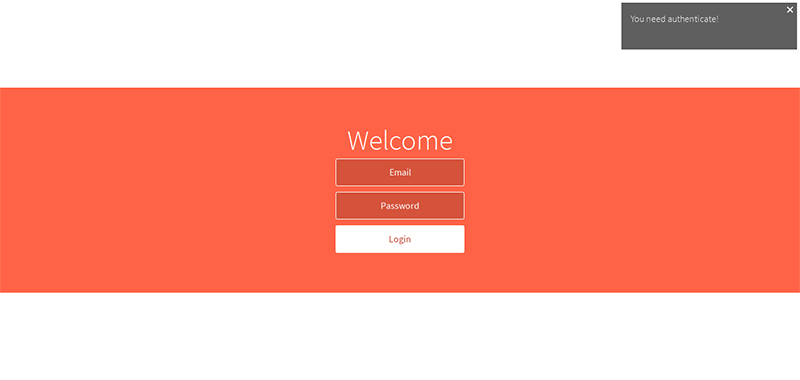

# Mailer

This is simple SPA app using the following technologies: [angular1.5.6](https://github.com/angular/angular.js), [angular-ui-router1.0.0](https://github.com/angular-ui/ui-router), [koajs](http://koajs.com), [passportjs](https://github.com/rkusa/koa-passport), [mongodb](https://www.mongodb.org), [mongoose](mongoosejs.com), [webpack2](https://github.com/webpack/webpack), [gulp4](https://github.com/gulpjs/gulp/tree/4.0), [babel6](babeljs.io).



## Quick start

1) Start [mongodb](https://www.mongodb.com/download-center?jmp=nav#community):

```sh
mongod --port 3003 --bind_ip "127.0.0.1"
```

The server uses mongoose to work with mongodb. The config file is located here:`config/cfg/mongoose.js`.

2) Install all dependencies using npm:

```sh
npm i
```

3) Build project:

```sh
npm run build:dev
```

The built files (js, css, img) are copied to here: `server/public/`

4) Load fixtures (`fixtures/models/`) into db:

```sh
npm run db:fixtures
```

5) Start nodejs server:

```sh
npm run server:dev
```

## Tasks

- build:clean - clean the built files from `server/public/`;
- build:dev - build project for development (without minification);
- build:prod - build project for production (with minification);
- build:watch - build project for development and starts proxy server for watching changes
- server:dev - start nodejs server;
- server:watch - start nodejs server via [nodemon](https://github.com/remy/nodemon), so you need to install this module globally;
- db:fixtures: load fixtures (`fixtures/models/`) to db

## API

The server has API routes for work with data application (login, logout, getting from db).If you passed to another url (not API), then the server will always return template `server/modules/spa/templates/index.jade` (because It's SPA).All API routes require authorization.If you are logged in then the server will respond 200, otherwise 401. For authenticate you need enable automatic sending cookies from js.See example below for `fetch`.

The server has following API routes:
- POST /api/login - authorizes user.

Login and password for users are located here: `fixtures/models/users.js`.
**Note** you need passed user's data into body of request using `urlencoded`.
**Note** you need enable automatic sending cookies from js for authenticate. For example for `fetch`:

```js
fetch("http://localhost:3000/api/login", {
  method: "POST",  
  headers: {  
    "Content-type": "application/x-www-form-urlencoded; charset=UTF-8"  
  },  
  credentials: "same-origin",
  body: "email=mike@test.ru&password=mike"
});
```

For example for [`$http`](https://docs.angularjs.org/api/ng/service/$http):

```js
let access = {email: "mike@test.ru", password: "mike"};

$http.post("http://localhost:3000/login", $httpParamSerializerJQLike(access), {
  headers: {
    "Content-Type": "application/x-www-form-urlencoded"
  }
}).then(res => res.data);
```

- POST /api/logout - logout for the current session.

For example for `fetch`:

```js
fetch("http://localhost:3000/api/logout", {
  method: "POST",  
  credentials: "same-origin"
});
```

- GET /api/users?offset=5&limit=10 - get 10 users from 5. Model see here: `server/modules/users/models/user.js`.
- GET /api/users/:id - get user by id
- DELETE /api/users/:id - remove user by id

- GET /api/count_letters - get json with the number of letters in mailboxes. Example body of response: `{"c7422f8013527a1c20d8dd6d":38,"af1cd994dfcb9286c394d142":8,"4a25fb4d024699c2d82bbd0a":4}`
- GET /api/letters/:id - get letter by id
- POST /api/letters/ - create new letter. Model see here: `server/modules/letters/models/letter.js`.
- DELETE /api/letters/:id - remove letter by id
- DELETE /api/letters - remove more then one letter. Example the body of request: {"deleteId":["4a25fb4d024699c2d82bbd0a","4a25fb4d024699c2d82bbd0b"]}

- GET /api/mailboxes - get all mailboxes. Model see here: `server/modules/mailboxes/models/mailbox.js`.
- GET /api/mailboxes/:id/letters - get letters by mailbox id
- DELETE /api/mailboxes/:id/letters - remove all letters by mailbox id

License
----

MIT
